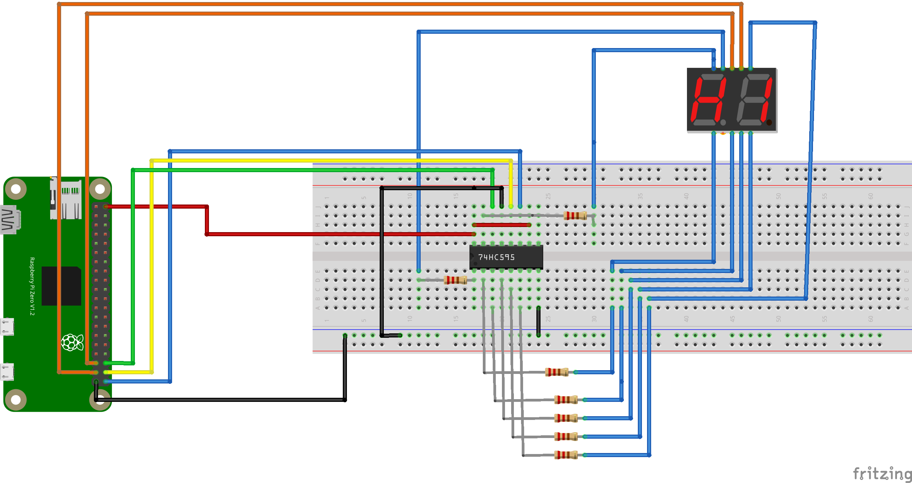

# 74HC595 Linux Kernel Driver for 7-Segment Displays

This Linux kernel module provides a platform driver and a `misc` character device interface for controlling two 7-segment displays using a 74HC595 shift register. The displays are driven via GPIO lines defined in the Device Tree and controlled through a kernel thread that multiplexes between the two digits.

## Features

- Platform driver bound via Device Tree using the compatible string `training,display`
- Supports dual 7-segment displays via GPIO-controlled 74HC595 shift register
- Uses `misc` device for user-space interaction
- Accepts simple write input from user space to display 1 or 2 decimal digits
- Digit multiplexing handled by a kernel thread
- Character device accessible with read/write from user space

## Hardware Interface

The driver uses the following GPIOs defined in the Device Tree:

- `data`: Serial data input to the 74HC595
- `clk`: Clock input to the 74HC595
- `latch`: Latch pin to transfer data to output
- `digit1`: Enable pin for first 7-segment digit
- `digit2`: Enable pin for second 7-segment digit

## Device Tree Example

```dts
mydisplay@0 {
	compatible = "training,display";
	label="mydisplay0";
	data-gpio = <&gpio 16 GPIO_ACTIVE_HIGH>;
	latch-gpio = <&gpio 20 GPIO_ACTIVE_HIGH>;
	clk-gpio = <&gpio 21 GPIO_ACTIVE_HIGH>;
	digit1-gpio = <&gpio 19 GPIO_ACTIVE_HIGH>;
	digit2-gpio = <&gpio 26 GPIO_ACTIVE_HIGH>;
	status = "okay";
};
```

## 🛠️ Wiring and Hardware Setup

The following setup uses a Raspberry Pi Zero, a 74HC595 shift register, and two common cathode 7-segment displays:

- **74HC595 pins:**
  - **DS (Serial Data)** → GPIO16 (data)
  - **SHCP (Clock)** → GPIO21 (clk)
  - **STCP (Latch)** → GPIO20 (latch)
  - **Q0–Q6** → Connected to the segments (A to G) of both displays
  - **Q7** → Not connected or used for dot segment if needed
- **7-Segment Displays:**
  - Both displays share the same segment inputs (A–G)
  - **Digit 1 Enable (common cathode)** → GPIO19 (digit1)
  - **Digit 2 Enable (common cathode)** → GPIO26 (digit2)
- **Multiplexing Logic:**
  - A kernel thread alternates between enabling digit1 and digit2 rapidly while shifting corresponding values into the 74HC595.

### 🔌 Circuit Diagram



> **Note:** Resistors are used between the 74HC595 outputs and the segment pins to limit current. Common values: 220Ω–330Ω.
