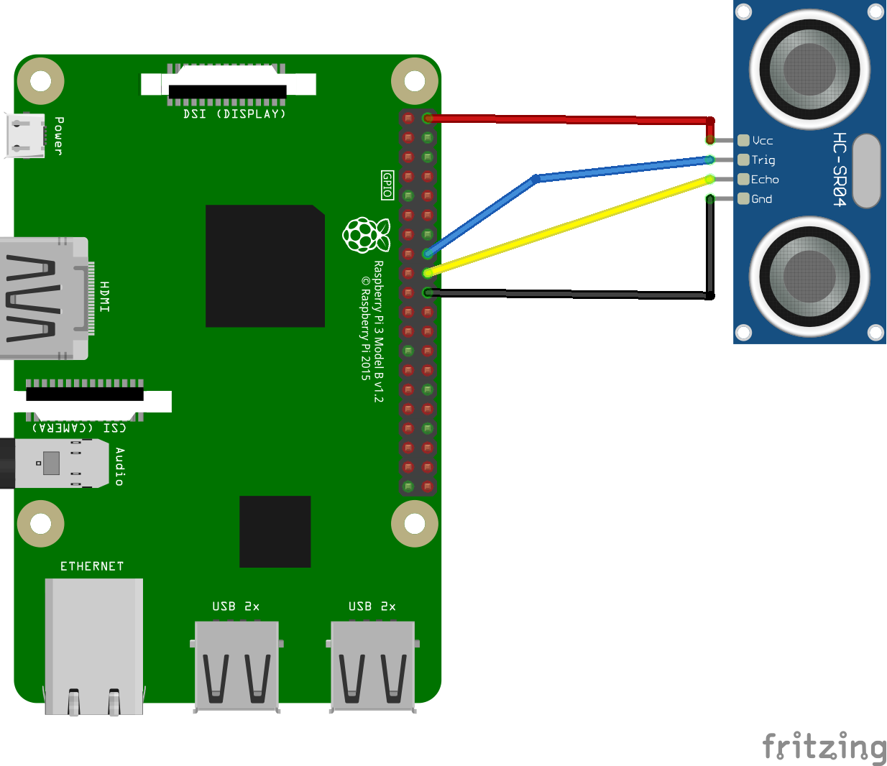

# 📡 HC-SR04 Linux Kernel Driver using GPIO Descriptor API (gpiod)

This kernel module implements a platform driver and a misc character device to interface with an **HC-SR04 ultrasonic distance sensor** using the GPIO descriptor API (`gpiod`) available in Linux kernel 6.12 and above.

## 🚀 Features

- Supports HC-SR04 sensor with separate trigger/echo GPIOs
- Uses `platform_driver` with Device Tree integration (`compatible = "training,hc-sr04"`)
- Measures distance via precise pulse timing using `ktime`
- Implements timeout handling (220ms default)
- Exposes distance through a character device (`/dev/hc-sr04`)
- No polling from userspace: reading from device triggers measurement
- Clean separation between kernel-space timing logic and user-space access

## 📦 Device Tree Node Example

Add the following to your Device Tree source (DTS) to declare the sensor:

```dts
hc_sr04 {
    compatible = "training,hc-sr04";
    trigger-gpios = <&gpio 17 GPIO_ACTIVE_HIGH>;
    echo-gpios = <&gpio 18 GPIO_ACTIVE_HIGH>;
    label = "hc-sr04";
    status = "okay";
};
```


## 🔌 Circuit Diagram



## 📂 Character Device Usage

Once the module is loaded and the driver is probed successfully, it creates the device:

```
/dev/hc-sr04
```

Read distance in centimeters (with decimal point):

```bash
cat /dev/hc-sr04  # Output: "Distance : 15.3"
```

### Internal Workflow

1. Send 10μs high pulse to trigger pin
2. Measure echo pulse duration using ktime
3. Calculate distance using speed of sound
4. Return formatted string to user space
5. Implement timeout protection (220ms)

## 🛠️ Kernel Version

Tested on **Linux kernel 6.12+** using Raspberry Pi Zero and GPIO descriptor API. Make sure your kernel supports `gpiod_*` functions and that Device Tree is enabled.

## 🧪 Output Example

```bash
$ cat /dev/hc-sr04
Distance : 24.7
```

> Distance is expressed in cm

